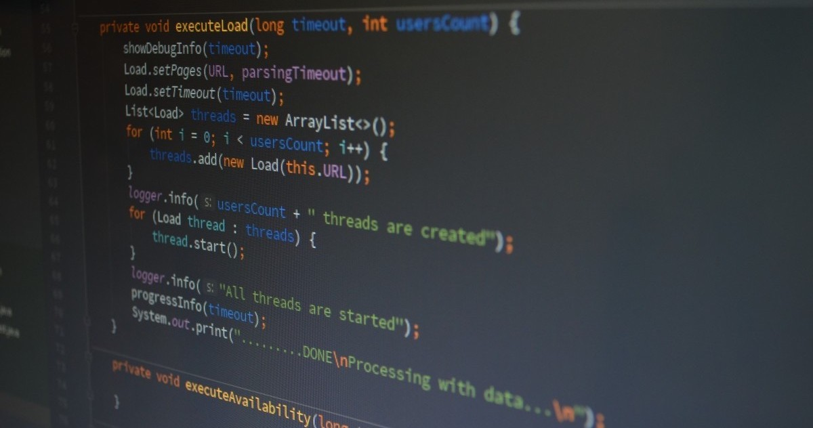

The compiler is a very powerful tool, if being used right.

> All roads lead to Rome.

There are always multiple ways to solve a particular problem.
In order to compare solutions, I almost universally stick to *Compile time > runtime*.

The idea is that I do as much work as possible before the software is running in its target environment.
Compile time is a simplification here.
Depending on the technology it might include things like:

* Source code validation
* Compilation
* Building artifacts (archives, images, executables, etc.)

## Use `final`, a lot

The compiler is one of the most powerful tools in my belt.
I try to write my code in a certain way so that I can maximize its power.

One prominent example is the compiler's ability to check that `final` *"variables"* are assigned exactly once before they are used.
Assuming we have the following code:

```java
T result = null;

switch (something) {
    case A: result = inCaseOfA();
    case B: result = inCaseOfB();
    case C: result = inCaseOfC();
}

// do something with A
```

When I'm reading this, there are some issues that I'm able to spot immediately.

1. Lack of explicit default case
2. `result` might still be null afterwards

If I now change the declaration to:

```java
final T result;
```

Then I successfully handed over this tedious task to check for (some of) the logical errors to the compiler.
The compiler immediately complain that there are scenarios in which `result` was never initialized.
Even better, it will also complain about the lack implicit fall-through due to the lack of break statements.
That's something I haven't even realized when I read it for the first time.

I'm obviously writing unit tests for this, so I'd ultimately catch it there.
The way I see it, there is no harm in having both, good unit tests and a useful compiler on my side.

Since I'm not a big fan of `break` (needs one additional line per case block), I'd rewrite the whole thing to:

```java
final T result = compute(something);

private T compute(final Something something) {
    switch (something) {
        case A: return inCaseOfA();
        case B: return inCaseOfB();
        case C: return inCaseOfC();
        default: return defaultValue();
    }
}

```

## [Primitive Obsession](../patterns/primitive-obsession.md)

There is a certain, well-known anti-pattern or smell, the [Primitive Obsession](https://refactoring.guru/smells/primitive-obsession).
The pattern to solve that also helps to push runtime errors towards compile time validation:

Instead of low level primitives like `int`, `boolean` and `String` one should strive towards typed, immutable value objects.
This is especially easy to do with Kotlin, but also Java with Lombok helps:

```kotlin
class UserId(private val value: String)
class Age(private val value: Int) : Comparable<Age> {
    operator fun plus(age: Age) = Age(value + age.value)
    override fun compareTo(other: Age): Int = value.compareTo(other.value)
}
```

## Polymorphism

The underlying idea (*Try to do things early and once.*) is also applicable during runtime.
I often prefer the use of polymorphic constructs over conditionals.
One side effect that I've seen a lot is that it pushes conditionals into construction.
Usually we'd evaluate conditionals during the whole lifecycle of an object, often repeatedly.
By using polymorphism there is often one conditional to decide which implementation to create and compose.
That is done at construction time of the object (graph) and no longer when it's being used.

(*Polymorphism vs. conditionals* deserves a post on its own.)

## Related

* [Staged Builders](../patterns/staged-builders.md)
* [Primitive Obsession](../patterns/primitive-obsession.md)

## References

* [Effective Java (Second Edition), Chapter 4 – Classes and Interfaces, Joshua Bloch, 2008](https://www.oreilly.com/library/view/effective-java-2nd/9780137150021/ch04.html)
* [Hardcore Java, Chapter 2 – The Final Story, Robert Simmons jr., 2004](https://www.oreilly.com/library/view/hardcore-java/0596005687/ch02.html)
* [The Clean Code Talks -- Inheritance, Polymorphism, & Testing](https://www.youtube.com/watch?v=4F72VULWFvc)
* [The Anti-IF Campaign](https://francescocirillo.com/products/the-anti-if-campaign)
* [Replace Conditional with Polymorphism](https://www.refactoring.com/catalog/replaceConditionalWithPolymorphism.html)
* [Unconditional Programming](https://michaelfeathers.typepad.com/michael_feathers_blog/2013/11/unconditional-programming.html)
