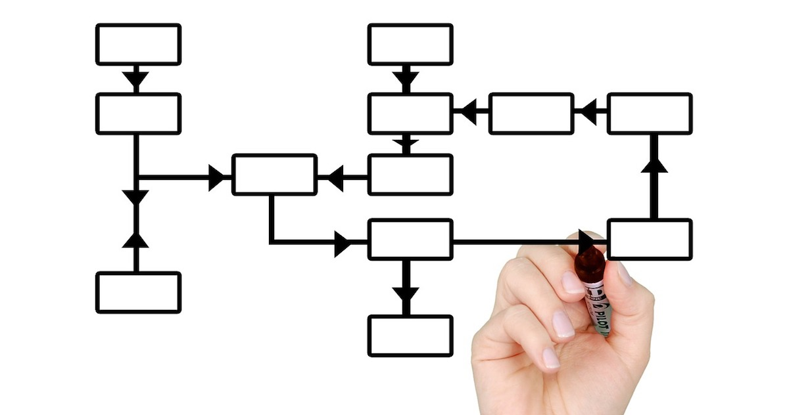

> [..] often referred to as a wizard for building objects.

Another pattern that I like to use a lot is *Staged Builder*.
The traditional implementation of the [Builder pattern](https://en.wikipedia.org/wiki/Builder_pattern) is usually not very safe against misuse.

It's a pattern that helps with [Compile time > runtime](../concepts-and-principles/compile-time-runtime.md) because it shifts validation from runtime to compile time.

Let's say there is a builder that produces a User.

```java
final var user = new UserBuilder()
    // misses first name, which is required
    .withLastname("..")
    .build()
```

The API of `UserBuilder` doesn't guide you how to properly use it.

The staged builder pattern introduces a proper interface, multiple in fact, without the need to change the builder implementation itself.
Apart from the fact that it should be package private then.

```java
interface FirstNameStage {
    LastNameStage withFirstName(String firstName);
}

interface LastNameStage {
    BuildStage withLastName(String lastName);
}

interface BuildStage {
    User build();
}
```

See also [Riptide: `HttpBuilder`](https://github.com/zalando/riptide/blob/9b2fd49e9c54a387cca1549a6973bc5c946123b9/riptide-core/src/main/java/org/zalando/riptide/Http.java#L28) which includes an example of mutually exclusive paths.

## References

* [Step builder pattern](https://svlada.com/step-builder-pattern/)
* [Immutable objects: Staged builder](https://immutables.github.io/immutable.html#staged-builder)
* [Next level Java 8 staged builders](https://medium.com/linagora-engineering/next-level-java-8-staged-builders-602530f68b75)
